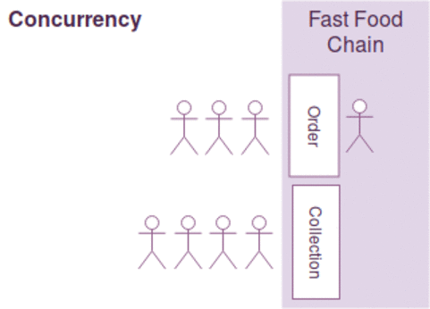
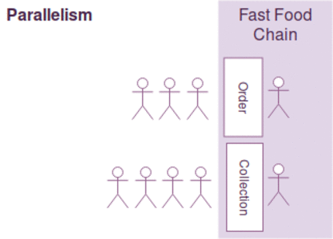

# Introduction to Parallelism

- [Introduction to Parallelism](#introduction-to-parallelism)
    - [Introduction](#introduction)
    - [Types of Parallelism](#types-of-parallelism)
      - [Data parallelism](#data-parallelism)
      - [Bit-level](#bit-level)
      - [Instruction-level](#instruction-level)
      - [Task](#task)
    - [Concurrency vs Parallelism](#concurrency-vs-parallelism)
    - [Definitions](#definitions)
      - [Thread](#thread)
      - [Process](#process)
      - [Multithreading​](#multithreading)
      - [Multiprocessing​](#multiprocessing)
      - [Concurrent Computing​](#concurrent-computing)
      - [Hertz](#hertz)
      - [Clock Speed](#clock-speed)
    - [References](#references)

### Introduction

A parallel computer is a collection of processing elements that cooperate to solve problems quickly.

### Types of Parallelism
Computer software are generally written for serial computing. Means, an algorithm divides a problem into smaller instructions, then CPU executes does tasks one after another.​

Three types of parallelism:​

#### Data parallelism
A set of tasks operate on independently on disjoint partitions​

```
each process does the same work on unique and independent pieces of data​

2 brothers mow the lawn ​

8 farmers paint a barn
```
#### Bit-level
increasing processors (CPU) size​

#### Instruction-level
grouping instructions together to run concurrently​

```
each process performs a different "function" or executes different code sections that are independent.​

2 brothers do yard work (1 edges & 1 mows) ​

8 farmers build a barn
```
#### Task 
dividing a problem/task into subtasks and run concurrently
```
each process performs the same functions but do not communicate with each other, only with a “Master” Process. These are often called “Embarrassingly Parallel” codes.
```

### Concurrency vs Parallelism

 | A                                      | B                                   |
 | -------------------------------------- | ----------------------------------- |
 |  |  |
 
### Definitions

#### Thread
A Thread, or thread of execution, is a software term for the basic ordered sequence of instructions that can be passed through or processed by a single CPU core.​

#### Process
An instance of execution of your file is called a process. Imagine a calc.py, when runs, it turns into a process.​

#### Multithreading​
Ability of a CPU running threads of execution concurrently, supported by the OS. Multiple threads share the same memory space.​
#### Multiprocessing​
The use of two or more CPU in a single computer system. Multiple processes have different memory space.​

#### Concurrent Computing​
Concurrent computing is a form of computing in which several computations are executed during overlapping time periods—concurrently—instead of sequentially (one completing before the next starts).

#### Hertz

The hertz (symbol: Hz) is the derived unit of frequency in the International System of Units (SI) and is defined as one cycle per second. 

Some of the unit's most common uses are in the description of sine waves and musical tones, particularly those used in radio- and audio-related applications. It is also used to describe the clock speeds at which computers and other electronics are driven.

#### Clock Speed
The CPU speed determines how many calculations it can perform in one second of time. ​The CPU requires a fixed number of clock ticks, or cycles, to execution or instruction.​ Measured in MHz.
 
- 1 MHz representing 1 million cycles per second, or 
- 1 GHz representing 1 thousand million cycles per second. 

### References

- [Concurrent Programming in Python is not what you think it is.](https://melvinkoh.me/concurrent-programming-in-python-is-not-what-you-think-it-is-cjye71swd001juns10c7jgitz)
- [About parallel computer design and history](https://computing.llnl.gov/tutorials/parallel_comp/​)
- [Threading vs Parallelism](http://www.danielmoth.com/Blog/threadingconcurrency-vs-parallelism.aspx​)
- [Good article on parallelism with Python](https://datascienceplus.com/how-to-achieve-parallel-processing-in-python-programming/)
- [On Parallel Machine Classification, Race Conditions and Deadlock](https://opensees.berkeley.edu/OpenSees/workshops/parallel/ParallelIntroduction.pdf)